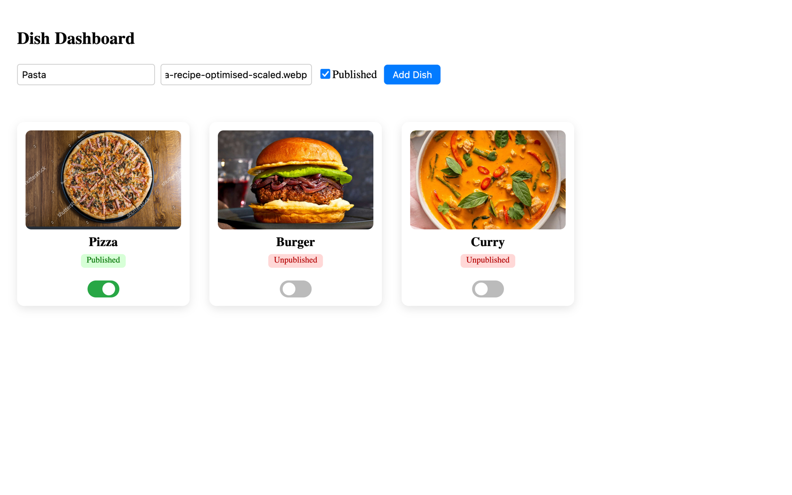
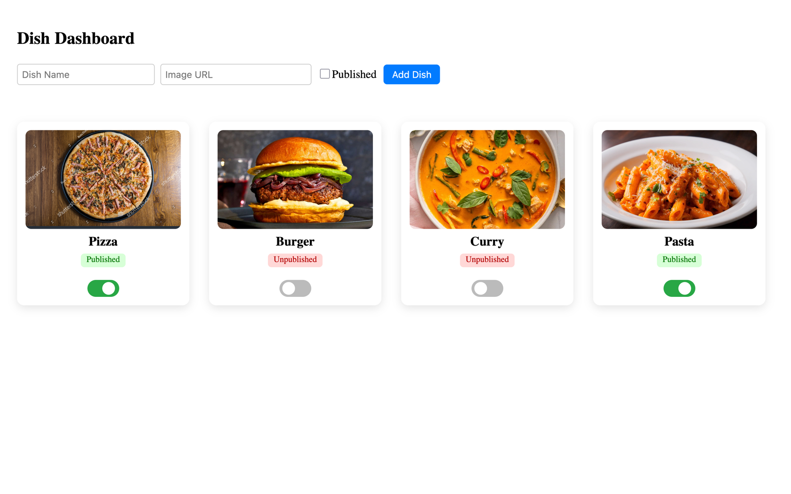

# Dish Dashboard

A full-stack application to manage and view dish information in real-time. It allows users to create new dishes, update their published status, and automatically reflects changes triggered directly in the backend or database without requiring a page refresh.

---

## Features

- Add new dishes with name, image, and published status.
- Toggle publish or unpublish status for any dish.
- Live update support using Socket.IO and MongoDB Change Streams.
- Backend-driven changes are instantly visible on the dashboard.
- Persistent data using MongoDB.

---

## Tech Stack

| Layer | Technology |
|-------|------------|
| Frontend | React, TypeScript, Vite, Socket.IO Client |
| Backend | Node.js, Express.js, Socket.IO |
| Database | MongoDB (Replica Set enabled for Change Streams) |

---

## Project Structure

```
Backend/
    ├── src/
    │    ├── Controller/ 
    |    |       |
    |    |       └── DishController.js
    |    ├── db/
    |    |       |
    |    |       └── connection.js
    │    ├── Model/
    |    |       |
    |    |       └── Dish.js
    │    ├── routes/
    |    |       |
    |    |       └── DishRoutes.ts
    │    └── index.js
    ├── package.json


Frontend/
 └── dish-dashboard/
        ├── src/
        |    ├── components/
        |    |       |
        |    |       └── DishForm.tsx
        |    ├── App.tsx
        |    └── main.tsx
        ├── index.html
        └── package.json

Screenshots/
 └── img.png
```

---

## Setup Instructions

### 1. Clone Repository
```bash
git clone https://github.com/utkarshmani/DishDashboard.git
cd DishDashboard
```

---

### 2. Start MongoDB with Replica Set Enabled
Required for real-time change streaming.

Stop regular MongoDB instance:
```bash
brew services stop mongodb-community
```

Run MongoDB in replica mode:
```bash
mongod --dbpath /opt/homebrew/var/mongodb --replSet rs0
```

Open new terminal:
```bash
mongosh
rs.initiate()
```

Verify replica set status:
```bash
rs.status()
```

State should be: PRIMARY

---

### 3. Backend Setup
```bash
cd Backend
npm install
npm start
```
Runs on: http://localhost:8080

---

### 4. Frontend Setup
```bash
cd ../Frontend/dish-dashboard
npm install
npm run dev
```
Runs on: http://localhost:5173

---

## API Endpoints

| Method | Endpoint | Description |
|--------|----------|-------------|
| GET | `/dishes/v1/get` | Fetch all dishes |
| POST | `/dishes/v1/post` | Add a new dish |
| PUT | `/dishes/v1/switch/:id` | Toggle publish status |

Example POST Body:
```json
{
  "dishName": "Pizza",
  "imageUrl": "https://example.com/pizza.jpg",
  "isPublished": true
}
```

---

## Screenshot







---

## Contact

Email: utakarsh.t@somaiya.edu  
GitHub: https://github.com/utakarsh23
LinkedIn: https://www.linkedin.com/in/tripathiutakarsh/